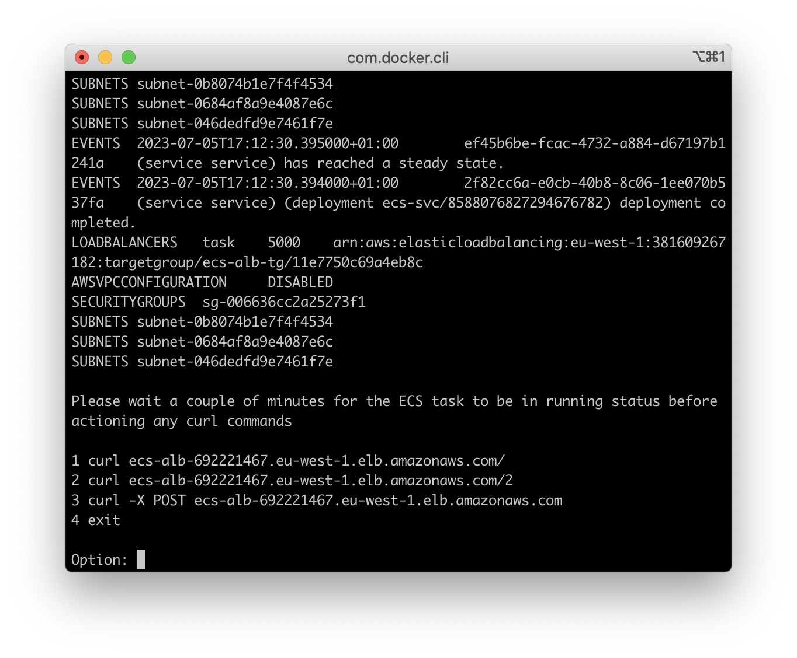
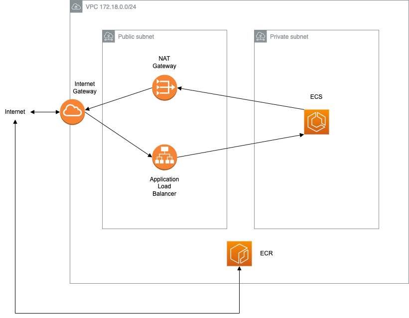

# Assessment

## Assumptions

It is assumed that one has access to an AWS account, has an access key ID and secret access key set up and configured, AWS CLI, Terraform and Docker installed on their machine.

---

## Terraform

You will note that in [infrastructure/backend.tf](infrastructure/backend.tf), there is no S3 bucket nor DynamoDB table name set for the Terraform state. This is so that it's easier to run the Bash script without any changes and have everything working. We could very easily have added:

```hcl
  backend "s3" {
    bucket = "cm-task-terraform-state"
    key    = "terraform.tfstate"
    region = "eu-west-1"

    dynamodb_table = "cm-task-terraform-state"
    encrypt        = true
  }
```

A VPC is created with the following CIDR ranges ([infrastructure/vpc.tf](infrastructure/vpc.tf)):
```
VPC CIDR
172.18.0.0/24

Private subnets
172.18.0.0/27
172.18.0.32/27
172.18.0.64/27

Public subnets
172.18.0.96/27
172.18.0.128/27
172.18.0.160/27
```

Please note that `desired_count` is set to `0` for the ECS service in [infrastructure/ecs.tf#L47](infrastructure/ecs.tf#L47) because we also have the Terraform [infrastructure/ecr.tf](infrastructure/ecr.tf) to create the ECR repository which will be empty at first until a Docker image is built and pushed to it.

---

## Bash script

[run.sh](run.sh):
* Prompt to continue
* Check AWS CLI, Terraform, Docker and Git are installed
* `terraform plan`
* Prompt to continue
* `terraform apply` with `-auto-approve` so to apply without asking for confirmation
* Once `terraform apply` is successful, it then clones repository https://github.com/mransbro/python-api
* Then build Docker image of Python application, tag and push to newly created ECR repository
* Then change the desired count of the ECS service from `0` to `1`
* Then get the `DNSName` of the newly created load balancer
* Then a switch statement providing `curl` commands to query against the load balancer showing ECS successfully running the Python application following the [example](https://github.com/mransbro/python-api#example) (see below) 

---

## Improvements

* Add ECS service autoscaling to scale up or down depending on conditions (wasn't able to add this due to time contraints)
* Add HTTPS listener to load balancer (omitted here due to needing a TLS certificate)
* Add VPC endpoint from ECS to ECR so avoiding the need to have NAT Gateway and Elastic IP addresses as ECS currently gets the Docker image from ECR via the Internet so not only being more cost effective but also better in terms of security
* Add GitHub actions workflow instead of executing Bash script
* Use EKS instead of ECS
* Or use API Gateway and Lambda instead of ECS

---

## Diagram


